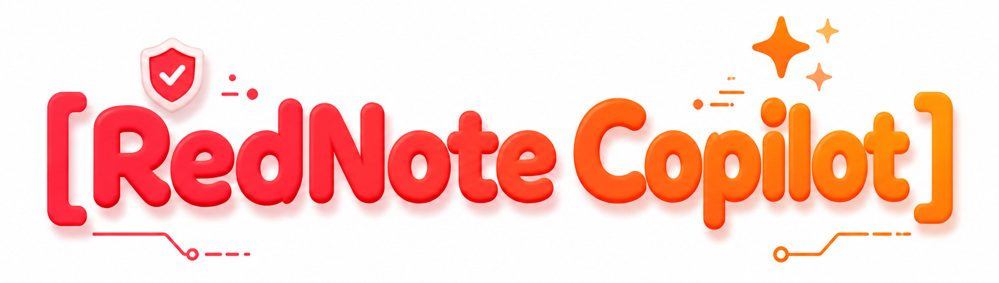
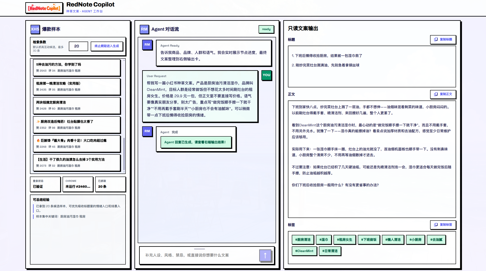
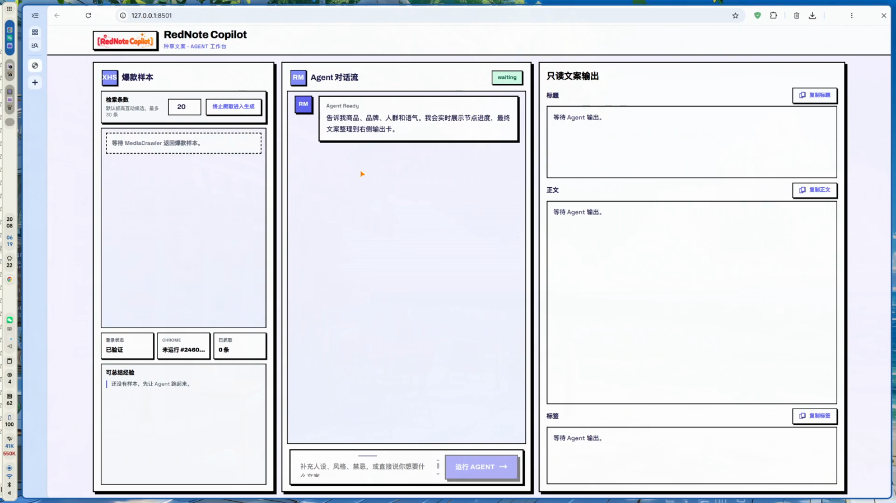
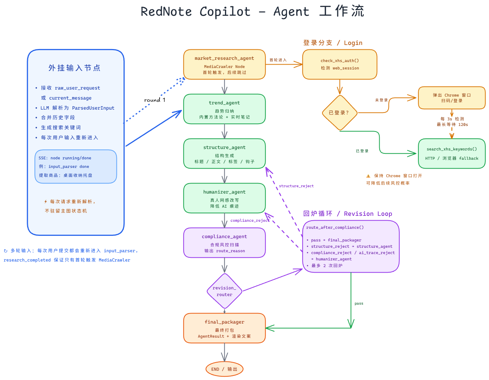
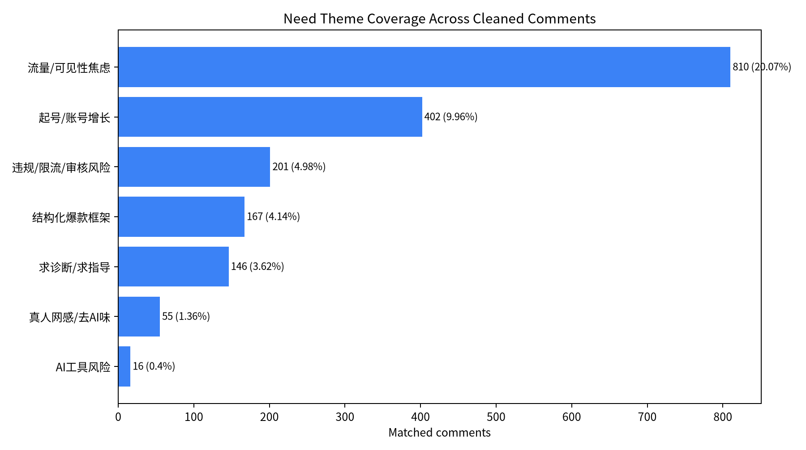
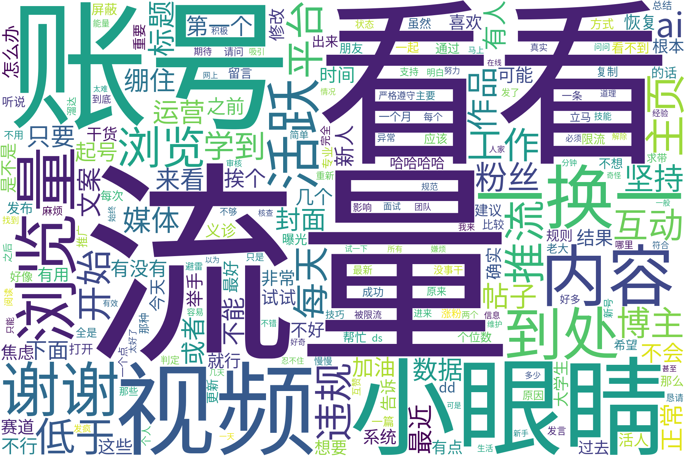

<div align="center">



# RedNote Copilot

[中文 README](./README.md)

[](./CHANGELOG.md)
[](https://www.python.org/)
[](./LICENSE)
[](https://fastapi.tiangolo.com/)
[](https://www.langchain.com/langgraph)
[](./Dockerfile)
[](./tests)
[]()

**AI-native content agent for Xiaohongshu (小红书) brand seeding.**<br>
Research-backed trend mining → structured viral drafting → humanized rewrite → compliance scanning → publish-ready copy.

<!-- HERO: Replace with app/workbench screenshot or demo GIF -->
<!-- Place video/screenshot at: docs/assets/hero-screenshot.png -->
<picture>
  <source media="(prefers-color-scheme: dark)" srcset="docs/assets/hero-screenshot-dark.png">
  <source media="(prefers-color-scheme: light)" srcset="docs/assets/hero-screenshot-light.png">
  
</picture>

</div>

---

## Why RedNote Copilot?

Most AI copywriting tools produce generic, templated Xiaohongshu posts that feel like ads and get buried by the algorithm. RedNote Copilot is built from the opposite direction: **we start with real creator anxiety data, mine high-interaction seeding patterns, and let a LangGraph agent generate, humanize, and police the copy until it passes compliance.**

### Workbench Preview

<p align="center">
  
</p>

### Usage Demo

<p align="center">
  <a href="docs/assets/rednote-copilot-usage-demo.mp4">
    
  </a>
  <br>
  <sub>Click the image to open the full usage demo video.</sub>
</p>

### Workflow Overview

<p align="center">
  
</p>

### Evidence: what creators actually worry about

We analyzed Xiaohongshu operation-related posts and comments to avoid building the product from imagined needs. The key point from the data is simple: users are not primarily asking for "more copy"; they are anxious about **traffic, visibility, compliance risk, and not knowing what structure makes a note work**.

**Data scope and denominator**

- Raw crawl: **15,832 JSONL rows**
- Target posts: **50 posts** around Xiaohongshu operation difficulty, limited traffic, note violation, multi-account operation, and viral-copy writing
- Comment pipeline: 4,962 raw comments -> 4,798 deduped comments -> **4,623 valid comments**
- Theme analysis denominator: **4,035 cleaned comments** after removing boilerplate/noise and very short unusable comments
- Coding method: fixed dictionary, multi-label topic coding; one comment can match multiple themes

| Rank | Pain point | Theme-coded comments | Share of coded comments | What it means for our agent |
|------|------------|----------------------|-------------------------|-----------------------------|
| 1 | Traffic / visibility anxiety | 810 | **20.07%** | Real-time viral search + trend pattern injection |
| 2 | Account growth & followers | 402 | **9.96%** | Audience-aware hooks and retention-oriented structure |
| 3 | Compliance / restriction risk | 201 | **4.98%** | Local compliance scanner + revision loop |
| 4 | Structured viral framework | 167 | **4.14%** | Title, cover, hook, body, and tag skeleton |
| 5 | Human voice / anti-AI feeling | 55 | **1.36%** | Humanizer node with multi-turn rewrite |

This means the product argument should be framed carefully:

- The strongest observed pain point is **low visibility / low traffic**, not AI itself.
- Compliance and restriction anxiety is lower in frequency, but severe enough to justify a risk-control layer.
- AI-specific complaints are sparse, so "anti-AI feeling" should be positioned as a quality and trust layer, not as the highest-frequency pain point.
- The strongest product need is a workflow: **structured generation -> humanized rewrite -> compliance scan -> revision**, which a one-shot chat model does not provide.

<table align="center">
  <tr>
    <td align="center">
      <br>
      <sub>Figure 1. Theme distribution of Xiaohongshu operation pain points</sub>
    </td>
    <td align="center">
      <br>
      <sub>Figure 2. Word cloud of operation discussion keywords</sub>
    </td>
  </tr>
</table>

Research summary:

| Metric | Value |
|--------|------:|
| Target posts | 50 |
| Raw comments | 4,962 |
| Deduplicated comments | 4,798 |
| Valid comments | 4,623 |
| Theme-analysis sample | 4,035 |

<!-- DEMO VIDEO: Replace with your recorded demo -->
<!-- Place demo video at: docs/assets/demo-video.mp4 -->

https://github.com/user-attachments/assets/rednote-copilot-demo-placeholder

---

## Features

<div align="center">

| Research | Drafting | Humanization | Compliance | Delivery |
|----------|----------|--------------|------------|----------|
| Real-time XHS viral search | Structured 6-part seeding skeleton | Anti-AI rewrite with voice memory | Local risk lexicon + LLM judge | CLI, API, and web workbench |
| Trend pattern injection | Dual-title + hook + tag generation | Rejection-driven revision loop | Hard-ad /导流 /极限词 scan | Copy-ready title, body, tags |
| Memory-backed brand facts | Scenario-first storytelling | Max-loop safety cap | Publish checklist + `needs_review` flag | SSE node streaming |

</div>

### Highlights

- **LangGraph-native workflow** — deterministic state machine with explicit reject/revision loops.
- **XHS Core integration** — built-in persistent browser, QR-code login, cookie management, and signed search (inspired by MediaCrawler).
- **Memory layer** — brand facts, product specs, and audience personas persist across sessions.
- **Compliance-first** — every draft is scanned before delivery; risky drafts are sent back for humanization or restructuring.
- **Three interfaces** — command-line, FastAPI, and a Flask web workbench.

---

## Same Input, Different Output Path

Example input: `Write a Xiaohongshu seeding post for CleanMint kitchen degreasing wipes. The target audience is renting women who cook often but do not want to spend much time scrubbing the stove. The price is 29.9 RMB per pack, but do not directly mention the price in the final copy. The tone should feel like a real friend sharing, not an ad.`

**Direct generic LLM API output:**

```text
Title: This kitchen degreasing wipe is seriously useful!

Everyone, I found a great CleanMint kitchen cleaning wipe. It removes oil stains easily and works on the stove, range hood, and wall. The price is also very friendly, so renters should definitely try it. After cooking, just take one wipe and the kitchen looks clean again.

#KitchenCleaning #CleaningTool #RentalHome #DegreasingWipes
```

**RedNote Copilot Agent output:**

```text
Titles:
1. After work I did not want to clean the kitchen, then one wipe saved me
2. If the stove is greasy after cooking, do not rush for the steel wool

Body:
After cooking dinner, there is always a thin oily layer on the stove. I used to look for gloves, spray cleaner, and wipe back and forth until I felt even more tired.

CleanMint's kitchen degreasing wipes made the cleanup feel less like a separate chore. I can pull one sheet after cooking and quickly wipe the stove edge and counter. The oil film comes off more easily, and the smell is not harsh.

It is not magic. Heavy oil still needs a few more passes. But for a small rental kitchen, using it right after cooking makes daily cleanup much easier.

How do you usually clean the stove after cooking? Any lazier method worth trying?

Tags: #KitchenCleaning #RentalKitchen #AfterWorkCooking #LazyCleaning #CleanMint
```

Why it is better: RedNote Copilot does not pass the prompt straight to a model. It separates product facts, user constraints, viral structure, and compliance risk into multiple workflow nodes. That helps it avoid direct price exposure, hard-sell language, and templated AI wording, while producing titles, body copy, and tags that fit the Xiaohongshu context more naturally.

---

## Quick Start: Docker Recommended

Docker installs backend dependencies and Playwright Chromium inside the image, which is the simplest path for demos and deployment.

Create the environment file first:

```bash
cp .env.example .env
```

Configure at least one OpenAI-compatible model provider. DeepSeek example:

```bash
DEEPSEEK_API_KEY=your_key_here
OPENAI_BASE_URL=https://api.deepseek.com
OPENAI_MODEL=deepseek-chat
```

Build the image:

```bash
docker build -t rednote-copilot-agent .
```

Start the web workbench (recommended):

```bash
docker run --rm -p 8501:8501 --env-file .env -v "$PWD/data:/app/data" rednote-copilot-agent \
  flask --app rednote_matrix.web.workbench run --host 0.0.0.0 --port 8501
```

Open:

```text
http://localhost:8501
```

On the first run that triggers Xiaohongshu real-time search, you will be prompted to log in to Xiaohongshu. Follow the browser window or QR code to complete login, and keep the login window alive until the workbench reports success; otherwise the search node will fail or be skipped.

Start the FastAPI service only:

```bash
docker run --rm -p 8000:8000 --env-file .env -v "$PWD/data:/app/data" rednote-copilot-agent
```

Health check:

```bash
curl http://localhost:8000/health
```

You can also use Docker Compose for the default API service:

```bash
docker compose up --build
```

Note: the current compose file starts FastAPI by default. Use the workbench command above when you want the browser UI.

## Local Development

Run the project in any isolated Python environment, such as conda, venv, or uv. Local environment directories are not committed.

```bash
pip install -r requirements-agent.txt
playwright install chromium
cp .env.example .env
```

CLI demo:

```bash
python -m rednote_matrix.cli examples/sample_input.json
python -m rednote_matrix.cli examples/risky_input.json
```

FastAPI:

```bash
python -m rednote_matrix.server.api
```

Flask workbench:

```bash
flask --app rednote_matrix.web.workbench run --host 0.0.0.0 --port 8501
```

Open http://localhost:8501

The workbench shows the LangGraph node stream in the center panel and renders final copy into read-only title/body/tags cards on the right.

<!-- WORKBENCH SCREENSHOT: Replace with your actual workbench screenshot -->
<!-- Place screenshot at: docs/assets/workbench-screenshot.png -->


---

## Research Methodology

Our trend rules are not hand-waved. They are distilled from a **2026-06-18 lightweight crawl** of high-interaction Xiaohongshu seeding content and creator operations discussions.

### Extracted viral patterns

- **Title patterns**: emotion/suspense first, strong scenario, light contrast, audience label, pitfall-avoidance.
- **Content skeleton**: specific scenario → old struggle/misconception → discovery moment → real feeling → limits/pitfalls → engagement hook.
- **Scoring dimensions**: keyword coverage, structural completeness, timeliness, content quality.

These patterns live in `rednote_matrix/skills/xiaohongshu/` and are consumed by `trend_agent` inside the LangGraph workflow. Full research notes: [`docs/xhs_viral_seed_20260618.md`](./docs/xhs_viral_seed_20260618.md).

### Pricing note

Users may input price information, but prices are used only for internal positioning and budget judgment. Final titles, bodies, and tags do **not** expose specific prices, selling prices, or promotional prices by default, reducing hard-ad and review risk.

---

## Testing

```bash
python -m unittest discover -s tests -v
```

---

## Test Environment Note

Due to limited time and devices, this project was developed and tested primarily on a local Arch Linux machine. Both the Docker and local development paths have been verified in this environment. Other operating systems or hardware platforms are theoretically portable but have not been practically verified. This delivery targets an MVP, so cross-platform compatibility and deployment are not the core focus at this stage.

## Roadmap

- [x] LangGraph agent end-to-end loop
- [x] XHS Core real-time search integration
- [x] Flask web workbench with SSE streaming
- [x] Memory layer and brand fact persistence
- [x] Compliance scanner with reject/revision loop
- [ ] Account-permission resilience for XHS search
- [ ] Frontend progress events during QR-code wait
- [ ] Logo and visual identity
- [ ] Demo video and screenshot gallery
- [ ] Multi-platform export (copy, Markdown, PDF)

---

## Contributing

Issues, PRs, and research feedback are welcome. Please keep changes minimal and aligned with the existing LangGraph structure. If you update features documented in `AGENTS.md`, update the corresponding docs as well.

## License

[MIT](./LICENSE)

---

<div align="center">

Built with ❤️ for creators who are tired of sounding like ads.

</div>
